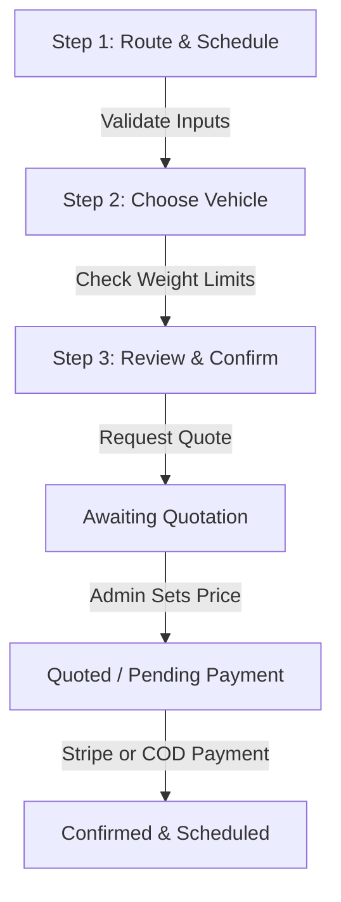

# GCLT Transport & Trucking Services
## Complete System User Manual & Operator Guide

Welcome to the **GCLT Transport & Trucking Services Logistics Management System (LMS)** user manual. This comprehensive guide covers all aspects of the GCLT application, detailing features for both public/customer users and system administrators. 

Certified specialists in heavy-duty road freight since **1998**, GCLT operates primarily out of the Subic Bay Freeport Zone (SBMA) and Olongapo City, offering nationwide logistics coverage across the Philippines. This digital platform facilitates seamless vehicle booking, fleet sales management, automated route optimization, secure payment integrations, and 24/7 AI-powered dispatch support.

---

## Table of Contents
1. [System Overview](#1-system-overview)
2. [User Account & Profile Management](#2-user-account--profile-management)
3. [Customer Portal: Booking & Transport Services](#3-customer-portal-booking--transport-services)
4. [Customer Portal: Fleet Sales & Viewing Appointments](#4-customer-portal-fleet-sales--viewing-appointments)
5. [24/7 AI Logistics Assistant](#5-247-ai-logistics-assistant)
6. [Stripe & Cash Payment Systems](#6-stripe--cash-payment-systems)
7. [Administrator Portal: Booking & Quotation Workflow](#7-administrator-portal-booking--quotation-workflow)
8. [Administrator Portal: Fleet & Inventory Management](#8-administrator-portal-fleet--inventory-management)
9. [Administrator Portal: Viewing Appointment & Scheduling Management](#9-administrator-portal-viewing-appointment--scheduling-management)
10. [System Configurations & Architecture Appendix](#10-system-configurations--architecture-appendix)

---

## 1. System Overview

### About GCLT Transport & Trucking Services
* **Headquarters:** Rizal Highway, SBMA, Subic Bay Freeport Zone, 2222 Philippines
* **Operational Scope:** Nationwide heavy-duty road freight, container drayage, specialized logistics, and fleet vehicle sales.
* **Service Capacity:** 120+ active heavy-duty trucks, 38 tractor units, 85 chassis units.
* **Core Regional Focus:** SBMA Port Access, Olongapo City, Central Luzon, and major highway systems connecting the National Capital Region (NCR).

### System Roles
1. **Public Guest / Visitor:** Can browse available heavy-duty trucks for sale, view company statistics, and interact with the public home page features.
2. **Registered Customer:** Can request transport quotations, track active bookings in real-time, pay invoices securely via Stripe, upload cash receipts for COD, view live truck sales inventory, schedule physical viewing appointments, and chat with the AI Logistics Assistant.
3. **System Administrator:** Full back-office control to evaluate cargo weights/dimensions, generate custom pricing quotes, manage fleet inventory, approve physical viewing appointments, process cash receipts, review transactions, notify users, and export operational datasets to CSV files.

---

## 2. User Account & Profile Management

### Registration and Authentication
Access the platform via the **Login / Register** page. Registration is supported through two methods:
* **Email & Password:** Enter a valid email address and a secure password. A verification email will be generated via Mailjet to confirm account authenticity.
* **Google Sign-In:** One-click integration with Google Accounts. No password setup is required; user profiles are automatically fetched and synced with Firebase Auth.

> [!NOTE]
> All users must verify their email addresses upon standard registration to enable advanced booking and purchasing capabilities. Unverified accounts will be prompted with a banner at the top of the interface.

### Profile Portal
Once logged in, users can access the **My Profile** tab from the dashboard sidebar:
* **Personal Metadata:** Edit Display Name, Primary Office/Base Location, and Contact Phone Numbers.
* **Security Settings:** Change passwords (for email-based accounts) or link/unlink secondary authentication providers.
* **Audit Logs:** Review recent account activities, including login locations, recent quotes requested, and payment history.

---

## 3. Customer Portal: Booking & Transport Services

GCLT features a highly intuitive **3-Step Cargo Booking Wizard** that streamlines transport planning. Navigate to **Book Transport** in the sidebar to begin.



### Step 1: Route & Schedule Configuration
In this step, customers input the physical boundaries and logistics details of the shipment:
1. **Pickup Location:** Fill in the Street Address/Building/Landmark, Barangay, and City/Municipality.
   * **Use My Location:** Uses browser Geolocation APIs to auto-detect the user's current coordinates, query the OpenStreetMap Nominatim API, and reverse-geocode the address into the input fields.
   * **Pin on Map:** Launches an interactive Leaflet Map modal. Click any point in the region to set a custom pin; the address will be automatically resolved.
2. **Drop-off Location:** Fill in the delivery details (supports "Use My Location" and "Pin on Map" options).
3. **Date & Time:** Choose a preferred pickup date (restricted to today or future dates) and choose a time slot.
4. **Cargo Type:** Select from four pre-configured classes:
   * **General:** Dry cargo, pallets, standard goods.
   * **Refrigerated:** Perishables requiring active temperature control.
   * **Hazardous:** Chemicals or sensitive goods requiring specialized safety clearance.
   * **Oversized:** Massive machinery, components exceeding normal dimensions.
5. **Cargo Weight & Dimensions:** Input estimated weight (in kilograms) and physical size (Length × Width × Height in meters).

#### Automated Route Assignment Logic
To guarantee safety and load compliance, GCLT implements real-time serverless route sorting:
* **The Old Road Route:** Automatically assigned if cargo weight is **$\ge$ 3,000 KG** or if cargo size is classified as oversized (e.g., includes keywords like "40ft", "container", "heavy", "oversize"). Avoids tight expressway bridges and matches heavy-load compliance.
* **The Expressway Route:** Automatically assigned for standard cargo under 3,000 KG to ensure rapid, efficient transit.

#### Inline Mapping & Distance Engine
Once pickup and drop-off coordinates are established, the **Leaflet Inline Map** renders the spatial path. It communicates with routing nodes to calculate the **Estimated Travel Distance** in kilometers. The distance is displayed in a dedicated card and acts as the multiplier for mileage-based pricing.

> [!WARNING]
> The system will trigger a warning and block navigation if the pickup street/city and delivery street/city are identical.

---

### Step 2: Choose Vehicle
The system fetches available trucks matching your criteria from Firestore:
* **Smart Recommendations:** Based on the cargo weight and dimensions entered in Step 1, the engine highlights the most optimal vehicle category (e.g., matching a 10-ton payload to a Large 10-Wheeler Wing Van).
* **Insufficiency Filter:** Vehicles with payloads or physical dimensions smaller than the cargo's specs are automatically greyed out and marked **"Insufficient Capacity"** to prevent scheduling errors.
* **Comparison Engine:** Select two or more available vehicles to compare their dimensions, payloads, and per-kilometer base rates side-by-side.

#### Fleet Categories
* **🛻 Small Trucks:** Payloads up to 2 tons (e.g., L300, Canter, AUV). Optimal for local, fast multi-drop deliveries.
* **🚛 Medium Trucks:** Payloads between 2 – 5 tons (e.g., 4-Wheeler or 6-Wheeler Elf). Excellent for commercial deliveries.
* **🚚 Large Trucks:** Payloads between 5 – 15 tons (e.g., 10-Wheeler Wing Vans, Heavy Rigids). Engineered for heavy industrial cargo.
* **🏗️ Specialized:** Refrigerated vans, heavy flatbeds, dry tankers.

---

### Step 3: Review & Confirm
Double-check all logistical parameters:
* **Special Instructions Input:** Add specific notes such as "gate pass required at SBMA Port", "fragile medical equipment", or "contact receiver at site".
* **Quote Request Submission:** Click **Request a Quote**. This registers the booking in Firestore with an initial status of `Quote Requested`.
* **Notifications & Email:** The customer receives a dashboard notification and an immediate email confirmation via Mailjet. Concurrently, an email alert and dashboard notification are pushed to the GCLT admin team.

---

### Tracking Bookings
Navigate to the **My Bookings** screen to track active jobs:
* **Quote Requested:** Submitted, awaiting pricing assessment from the logistics team.
* **Quoted:** The administrator has calculated the route fees and applied a custom amount. Customers will see a notification and can review the final invoice.
* **Pending Payment:** Quote has been accepted by the customer. Awaiting payment authorization.
* **Confirmed:** Payment received/verified. The vehicle and driver are officially assigned to the route.
* **In Transit:** The truck is active on the road.
* **Completed:** Delivery successfully finalized. Proof of delivery uploaded.
* **Cancelled / Declined:** The booking was terminated or rejected due to compliance/availability.

---

## 4. Customer Portal: Fleet Sales & Viewing Appointments

GCLT sells certified, decommissioned, or brand-new heavy-duty vehicles. Public and registered users can browse these listings.

### Browsing the Inventory
Navigate to the **Browse Trucks** or **Trucks for Sale** section.
* **Vehicle Spec Sheets:** Each truck card displays detailed mechanical blueprints:
  * **Engine Specs:** Horsepower, cylinder configuration, fuel economy.
  * **Mileage:** Actual odometer readings in kilometers.
  * **GVW (Gross Vehicle Weight):** Total structural load limit in tons.
  * **Condition & History:** Classified as Brand New, Certified Refurbished, or Pre-Owned.
  * **Blueprints:** Detailed interior and chassis galleries.

### Scheduling a Physical Viewing Appointment
Interested buyers can request an on-site, physical inspection:
1. Click **Schedule Viewing** on the selected truck detail page.
2. Complete the form inputs:
   * **Full Name & Contact Number.**
   * **Current Office/Base Location:** Helps GCLT prepare logistics.
   * **Preferred Date & Time:** Operations are scheduled from Monday to Saturday, 8:00 AM to 5:00 PM.
   * **Special Requests:** e.g., "Request engine dry-test", "Need mechanical lift inspection".
3. Submit the appointment. A reservation slot is generated, and a real-time Firestore hook synchronizes with the admin's scheduler.

---

## 5. 24/7 AI Logistics Assistant

For instant customer support, GCLT incorporates a conversational artificial intelligence agent. Navigate to **AI Assistant** in the dashboard.

### Assistant Capabilities
* **Interactive Suggestions:** Quick-reply buttons like *"SBMA Availability"*, *"Rates to Olongapo"*, or *"Track Booking"* trigger rapid context searches.
* **Live Inventory Tracking:** The AI communicates directly with the Firestore collection `trucksForSale`. When you ask, *"What trucks are for sale?"*, the assistant lists only the exact models, prices, and specifications currently active in the database.
* **Routing Assistance:** Explains shipping constraints, weight regulations, and routing differences (Old Road vs. Expressway rules).
* **Technical Resiliency:** Includes 429 Rate-Limit error recovery, notifying users gracefully during high api demand.

---

## 6. Stripe & Cash Payment Systems

To accommodate all business styles, GCLT provides hybrid payment flows:

```
                  ┌──────────────────────┐
                  │    Booking Quoted    │
                  └──────────┬───────────┘
                             │
                             ▼
              [ Choose Payment Method ]
              /                       \
             /                         \
    ( Online Stripe )            ( Cash / COD )
          │                             │
    [ Payment Form ]             [ Driver Collects ]
          │                             │
    [ Auto-Verified ]            [ Upload Receipt Image ]
          │                             │
          │                             ▼
          │                      [ Admin Approves ]
          ▼                             ▼
   ┌──────────────┐              ┌──────────────┐
   │  Confirmed   │              │  Confirmed   │
   └──────────────┘              └──────────────┘
```

### 1. Secured Online Payments (Stripe)
* Pushing the online payment button triggers Stripe checkout. 
* Securely processes major credit cards, debit cards, and e-wallets.
* Transactions are fully encrypted. Upon confirmation, Stripe webhooks trigger a status update to `Confirmed` and generate an automatic receipt email.

### 2. Cash on Delivery (COD) / Cash on Inspection
* Selected for physical truck sales reserves or regional cargo deliveries.
* **Proof of Payment Upload:** When cargo is delivered or cash changes hands, the client or driver takes a photo of the cash receipt.
* **Image Compression Pipeline:** Uploading the receipt runs a client-side canvas utility. The image is compressed to a maximum width of 800px at a 70% quality ratio. This preserves bandwidth and minimizes database storage bloat.
* **Verification:** The administrator reviews the uploaded receipt image in their panel and officially transitions the status to `Confirmed`.

---

## 7. Administrator Portal: Booking & Quotation Workflow

The administrator dashboard is the control center for GCLT dispatch operations. Navigate to the **Admin Dashboard** and select **Bookings**.

### Booking Operations
* **Global Search Filter:** Find bookings instantly by ID, customer name, date range, location, status, or amount.
* **CSV Data Export:** Export the filtered set of bookings into a fully formatted CSV spreadsheet. Generates column-aligned data for external accounting.
* **Quotation Panel:**
  * When a customer requests a quote, it is marked yellow as `Quote Requested`.
  * The admin opens the booking details sidebar, reviews the auto-route recommendation, verifies cargo dimensions, and inputs a price in PHP.
  * Clicking **Send Quote** writes the price, transitions the status to `Quoted`, triggers a push notification to the client's dashboard, and generates a detailed HTML email invoice.

### Status Control & Receipts
* Admin controls the step-by-step progress of shipments:
  * **Quote Requested $\rightarrow$ Quoted $\rightarrow$ Pending Payment $\rightarrow$ Confirmed $\rightarrow$ In Transit $\rightarrow$ Completed**
* For Cash/COD bookings, the admin can view the uploaded proof-of-payment image directly in the sidebar, replace it if needed, or approve the transaction.
* **Direct Notifications:** A text area allows the admin to send a custom message or notification directly to the specific user's dashboard (e.g., *"Your driver John has arrived at Subic Bay Port Gate 2"*).

---

## 8. Administrator Portal: Fleet & Inventory Management

Admin controls the physical vehicles operating in the logistics pipeline.

### Managing Active Fleet
* **Add Vehicle:** Input the truck make/model, category (Small, Medium, Large, Specialized), max payload (in tons), container dimensions, current registration plates, and operational status.
* **Live Status Toggles:** Set trucks to `Available`, `In Maintenance`, or `On Route`. Trucks marked `In Maintenance` are automatically filtered out from the customer booking wizard.
* **Photo Library:** Upload high-resolution images of the trucks. Built-in canvas compression applies to prevent server storage overload.

### Managing Trucks for Sale
* **Inventory Control:** Create listings for commercial truck sales. Include:
  * Manufacturer year, transmission type, mileage, horsepower, GVW.
  * Set prices, conditions (Pre-owned, certified, new), and locations (Olongapo yard, SBMA depot).
* **Mark as Sold:** Single-click action to remove the vehicle from the active public catalog while keeping the sales record in the database for financial tracking.

---

## 9. Administrator Portal: Viewing Appointment & Scheduling Management

Manage incoming vehicle inspections for commercial truck sales.

### Appointment Review
* **Calendar Dispatch:** An integrated schedule calendar lists all customer viewing requests by date and time slot.
* **Assigning Sales Reps:** The admin can approve an appointment and assign a dedicated GCLT sales representative to host the customer at the SBMA yard.
* **Status Updates:** Mark appointments as `Approved`, `Rescheduled`, `Completed`, or `Declined`. Any changes trigger a real-time notification to the client's profile page and an automated notification email.

---

## 10. System Configurations & Architecture Appendix

For developers and system maintainers, here is the technical structure of GCLT LMS:

### Technology Stack
* **Framework:** Next.js 14 (App Router) utilizing React 18.
* **Styling:** Custom modular CSS (`app/globals.css`, `app/admin.css`, responsive frameworks).
* **Database & Auth:** Firebase Firestore (NoSQL hierarchical collections) & Firebase Authentication.
* **Mapping Engine:** Leaflet.js with OpenStreetMap (OSM) tile layers and Nominatim reverse-geocoding.
* **Payments:** Stripe API (webhooks, secure token validation).
* **Email Dispatch:** Mailjet API integration via serverless node handlers.
* **AI Core:** Google Gemini 2.5 Flash model API.

### Key Database Collections (Firestore)
* **`bookings`:** Stores transport details, coordinates, statuses, quotation values, and receipt media.
* **`fleet`:** Stores logistics truck inventory, payloads, and availability states.
* **`trucksForSale`:** Stores heavy-duty truck retail details, prices, and specifications.
* **`appointments`:** Stores customer physical viewings, preferred dates, and assigned sales reps.
* **`notifications`:** Tracks dashboard notifications with query indexes targeted by `userId`.

---
*GCLT LOGISTICS MANAGEMENT SYSTEM — DIGITAL OPERATING MANUAL. SERVING THE CENTRAL LUZON INFRASTRUCTURE SINCE 1998.*
